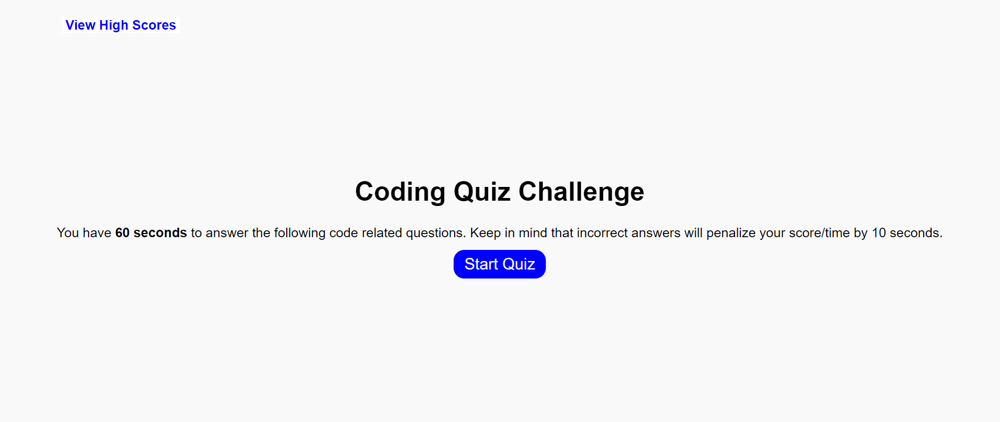

# Module 4 Project

## Description

This a code quiz project as a part of week 4 assignments for the UofT Flex Bootcamp.

## Installation

N/A

## Usage

Click on "Start Game" to start quiz. You will have 60 seconds to answer the code related questions. Keep in mind that incorrect answers will penalize your score/time by 10 seconds.

## Preview of Page

## Credits

Page used as reference for classList

https://developer.mozilla.org/en-US/docs/Web/API/Element/classList

## License

Please refer to the LICENSE in the repo.